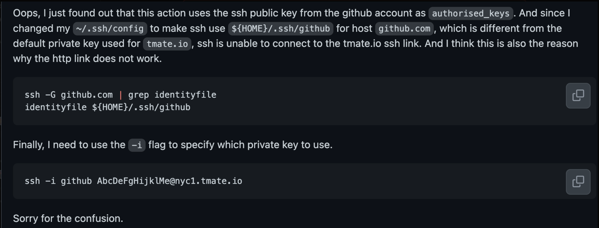

# IT Validation Configuration

## Overview

The IT validation system is a comprehensive integration testing framework designed to validate Oracle WebLogic Server deployments on Azure across multiple scenarios and configurations. It automates the execution of various deployment scenarios, monitors their progress, and generates detailed reports to ensure the reliability and quality of the Azure WebLogic templates.

### Key Features

- **Multi-Scenario Testing**: Execute multiple test scenarios simultaneously or sequentially
- **Flexible Execution Modes**: Support for both parallel and serial execution modes
- **Comprehensive Reporting**: Detailed reports with success/failure statistics and execution URLs
- **Automated Monitoring**: Real-time tracking of workflow execution with timeout protection
- **Resource Management**: Efficient cleanup and resource optimization for cost-effective testing

### Use Cases

- **Regression Testing**: Validate WebLogic templates after code changes or updates
- **Release Validation**: Comprehensive testing before production releases
- **Configuration Testing**: Verify different deployment configurations and parameters
- **Performance Monitoring**: Track deployment times and resource utilization

## Table of Contents

- [System Architecture](#system-architecture)
- [Configuration Structure](#configuration-structure)
  - [Scenarios Structure](#scenarios-structure)
  - [Execution Modes](#execution-modes)
- [How It Works](#how-it-works)
- [Available Files](#available-files)
  - [File Content Overview](#file-content-overview)
- [Getting Started](#getting-started)
  - [Quick Start Guide](#quick-start-guide)
  - [Prerequisites](#prerequisites)
- [IT Action Usage](#it-action-usage)
  - [Action Inputs](#action-inputs)
  - [Action Outputs](#action-outputs)
- [Structure Requirements](#structure-requirements)
- [Serial vs Parallel Execution](#serial-vs-parallel-execution)
- [Report Generation](#report-generation)
  - [Status Tracking](#status-tracking)
  - [Accessing Reports](#accessing-reports)
- [Error Handling](#error-handling)
- [Trouble Shooting](#trouble-shooting)
  - [Debugging with tmate](#debugging-with-tmate)
  - [Some notes on preparing a new Azure subscription to run the tests](#some-notes-on-preparing-a-new-azure-subscription-to-run-the-tests)


## System Architecture

The IT validation system consists of:

1. **Validation Plan Files** (this directory): JSON files defining what to test
2. **IT Action** (`/.github/actions/it/action.yml`): Reusable composite action that executes the plans
3. **IT Workflows** (`/.github/workflows/it-validation-*.yaml`): Workflows that trigger the action with specific plans
3. **Target Workflows** (`/.github/workflows/testWls*.yml` and `buildWls*.yml`): The actual validation workflows that get executed

## Configuration Structure

The validation plan files use the following structure:

### Scenarios Structure
Each validation plan defines scenarios with descriptive names:

```json
{
  "validation_scenarios": [
    {
      "workflow": "testWlsVmAdmin.yml",
      "run_mode": "serial",
      "scenarios": [
        {
          "scenario": "Test Admin Server on VM with mssqlserver",
          "inputs": {
            "location": "centralus"
          }
        }
      ]
    }
  ]
}
```

### Execution Modes

You can control how scenarios within a workflow are executed by using the optional `run_mode` property:

- **`"run_mode": "serial"`**: Scenarios are executed one after another. Each scenario must complete before the next one starts.
- **`"run_mode": "parallel"`** or **no `run_mode` specified**: Scenarios are executed simultaneously (default behavior).

**Example with serial execution:**
```json
{
  "validation_scenarios": [
    {
      "workflow": "testWlsVmCluster.yml",
      "run_mode": "serial",
      "scenarios": [
        {
          "scenario": "First scenario",
          "inputs": { /* ... */ }
        },
        {
          "scenario": "Second scenario",
          "inputs": { /* ... */ }
        }
      ]
    }
  ]
}
```

**When to use serial mode:**
- Resource-intensive scenarios that might conflict if run simultaneously
- Scenarios that need to run in a specific order
- Limited resource environments where parallel execution might cause failures

## How It Works

1. **IT Workflows**: The `it-validation-*.yaml` workflows are triggered (manually or scheduled)

2. **Plan File Mapping**: Each IT workflow maps its input to a specific validation plan file in this directory

3. **Action Execution**: The workflow calls the IT action (`/.github/actions/it/action.yml`) with the plan file path

4. **Plan Processing**: The action reads the validation plan and processes each scenario

5. **Execution Mode**: The optional `run_mode` property controls whether scenarios are executed serially or in parallel

6. **Workflow Triggering**: The action triggers the specified target workflows with the scenario inputs

7. **Monitoring**: The action monitors workflow execution and waits for completion

8. **Reporting**: Results are compiled into comprehensive reports and stored in the `it` branch

## Available Files

- `validation-plan-aks.json`: Azure Kubernetes Service (AKS) validation scenarios for WebLogic Server deployments
- `validation-plan-build.json`: Build-only validation scenarios for template compilation and syntax checking
- `validation-plan-vm-admin.json`: WebLogic Admin Server on VM validation scenarios
- `validation-plan-vm-cluster.json`: WebLogic Configured Cluster on VM validation scenarios  
- `validation-plan-vm-dynamic-cluster.json`: WebLogic Dynamic Cluster on VM validation scenarios

### File Content Overview

Each validation plan targets specific WebLogic deployment scenarios:

- **AKS Plans**: Test WebLogic Server deployments on Azure Kubernetes Service with various database configurations
- **VM Plans**: Test WebLogic Server deployments on Azure Virtual Machines in different topologies (Admin Server, Configured Cluster, Dynamic Cluster)
- **Build Plans**: Validate artifact compilation and template syntax without actual deployments

## Getting Started

### Quick Start Guide

This section assumes the prerequisites are already satisfied. See [Prerequisites](#prerequisites).

1. **Choose a Validation Plan**: Select the appropriate validation plan file based on your testing needs:
   - For AKS deployments: `validation-plan-aks.json`
   - For Admin Server on VM: `validation-plan-vm-admin.json`
   - For Configured Cluster on VM: `validation-plan-vm-cluster.json`
   - For Dynamic Cluster on VM: `validation-plan-vm-dynamic-cluster.json`
   - For build validation only: `validation-plan-build.json`

2. **Trigger IT Validation**: Use the GitHub Actions interface to manually trigger a IT validation workflow:
   - Go to the "Actions" tab in the repository
   - Select the appropriate `it-validation-*` workflow:
     - `IT Validation for AKS` - for AKS deployments
     - `IT Validation for VM Admin` - for Admin Server on VM
     - `IT Validation for VM Cluster` - for Configured Cluster on VM  
     - `IT Validation for VM Dynamic Cluster` - for Dynamic Cluster on VM
     - `IT Validation for Build` - for build-only validation
   - Click "Run workflow" and select your desired validation plan

3. **Monitor Progress**: Track the execution progress in the Actions tab and view real-time logs

4. **Review Results**: Check the generated reports in the `it` branch under `it-report/` directory

### Prerequisites

Before using the IT validation system, ensure:

- [ ] Azure subscription with appropriate permissions
   - Microsoft Entra permissions
      - Global Administrator
   - Azure RBAC
      - Contributor
      - User Access Administrator
      - or
      - Owner
- [ ] GitHub repository with Actions enabled
- [ ] Required secrets configured in repository settings. There are two separate setup scripts, one for VM workflows and one for AKS workflows. You must run the appropriate script(s) depending on which validation plans you intend to execute.

   **For VM workflows** (`validation-plan-vm-admin.json`, `validation-plan-vm-cluster.json`, `validation-plan-vm-dynamic-cluster.json`):

   1. Edit [credentials-params-wls-vm.yaml](../resource/credentials-params-wls-vm.yaml) and fill in the required parameter values (e.g., `OTN_USERID`, `OTN_PASSWORD`, `WLS_PSW`, `USER_EMAIL`, `USER_NAME`, `GIT_TOKEN`). Parameters with default values can be left as-is unless you need to override them.
   2. Run the [setup-for-wls-vm.sh](../workflows/setup-for-wls-vm.sh) script:
      ```bash
      cd .github/workflows
      bash setup-for-wls-vm.sh
      ```

   **For AKS workflows** (`validation-plan-aks.json`):

   1. Edit [credentials-params-wls-aks.yaml](../resource/credentials-params-wls-aks.yaml) and fill in the required parameter values (e.g., `ORC_SSOUSER`, `ORC_SSOPSW`, `WDT_RUNTIMEPSW`). Parameters with default values can be left as-is unless you need to override them.
   2. Run the [setup-for-wls-aks.sh](../workflows/setup-for-wls-aks.sh) script:
      ```bash
      cd .github/workflows
      bash setup-for-wls-aks.sh
      ```

   Both scripts require that you have already run `az login`, `gh auth login`, and have `yq` 4.x installed. The scripts will set the required GitHub repository secrets automatically.

- [ ] Access to the `it` branch for report storage

## IT Action Usage

The validation plans are consumed by the IT action located at `/.github/actions/it/action.yml`. 

### Action Inputs

| Input | Description | Required |
|-------|-------------|----------|
| `it_file` | Path to the validation plan file | Yes |

### Action Outputs

| Output | Description |
|--------|-------------|
| `results` | JSON string containing the results of all workflow executions |
| `report_timestamp` | Timestamp of the generated report |
| `report_url` | URL to the generated report on the IT branch |

## Structure Requirements

- Each plan must have a `validation_scenarios` array
- Each item in the array must have a `workflow` and `scenarios` field
- Each scenario must have a `scenario` name and an `inputs` object
- The optional `run_mode` field can be set to `"serial"` or `"parallel"` (default)
- Only the `inputs` object content is passed to the target workflow

## Serial vs Parallel Execution

### Parallel Execution (Default)
- All scenarios within a workflow are triggered simultaneously
- Faster overall execution time
- Suitable for independent scenarios that don't compete for resources

### Serial Execution
- Scenarios are executed one after another
- Each scenario must complete before the next one starts
- Longer overall execution time but better resource management
- Includes waiting and monitoring between scenarios
- Recommended for resource-intensive workloads or debugging

## Report Generation

The IT action generates comprehensive reports that include:

- **Summary Statistics**: Total workflows, success/failure counts including cancelled and timeout scenarios
- **Detailed Results**: Individual workflow results with duration and status  
- **Execution URLs**: Direct links to workflow runs
- **Execution Notes**: Information about serial vs parallel execution

Reports are:
1. Uploaded as GitHub Actions artifacts
2. Committed to the `it` branch in the `it-report/` directory
3. Accessible via the repository's IT branch

### Status Tracking

The system tracks all execution outcomes:
- **Success**: Workflows completed successfully
- **Failure**: Workflows failed during execution  
- **Timeout**: Workflows exceeded the 60-minute timeout limit
- **Cancelled**: Workflows manually cancelled by users
- **Other Failed**: Workflows with any other non-success status

### Accessing Reports

Reports can be accessed in multiple ways:

1. **GitHub Actions Artifacts**: Download reports directly from the workflow run artifacts
2. **IT Branch**: Browse reports in the `it` branch under `it-report/` directory  
3. **Direct Links**: Use the `report_url` output from the IT action
4. **API Access**: Programmatically access reports via GitHub API

#### Report File Naming Convention

Reports follow the naming pattern: `report-YYYYMMDD-HHMMSS.json`

Example: `report-20250804-103000.json` (August 4, 2025 at 10:30:00 UTC)

## Error Handling

The IT action includes robust error handling:
- **Timeout Protection**: 60-minute maximum wait time per workflow
- **Failure Detection**: IT workflow fails if any triggered workflow fails, times out, or is cancelled

## Trouble Shooting

### Debugging with tmate

One of the biggest pain points to develop GitHub actions for our Java EE solution offerings is that it's hard to debug them by direct interacting with the host system on which the actual Actions are running.

I found a GitHub action `tmate` which unlocks the door for debugging GitHub actions using SSH or Web shell, pls refer to [Debugging with tmate](https://github.com/marketplace/actions/debugging-with-tmate) or to the [tmate docs](https://mxschmitt.github.io/action-tmate/) for detailed how-to instructions.

And here is an example where `tmate` was applied in `integration-test` workflow of `liberty-on-aks` repo:
* https://github.com/WASdev/azure.liberty.aks/pull/62/files#diff-b6766eb8febc0c51651250cd0cdfb44c4f0d3256470d88e62bf82fd46aa73ae0R119-R121


## Authentication of the tmate session.
> Refer to this [issue](https://github.com/mxschmitt/action-tmate/issues/163)’s [comment](https://github.com/mxschmitt/action-tmate/issues/163#issuecomment-1651436411), 

this [action](https://github.com/mxschmitt/action-tmate) uses the ssh public key from the github account as `authorised_keys`.
So if you have multiple private keys in your local machine, you may need to specify the private key used for `*.tmate.io` in your `~/.ssh/config` file.



### Some notes on preparing a new Azure subscription to run the tests

The following lessons were learned while bringing up the CI/CD pipelines on a net-new Azure subscription. If you are configuring a fresh subscription for the first time, these are essential to know.

#### 1. Register required Azure resource providers

A new subscription may not have all the necessary resource providers registered. Run the [register-providers.sh](../resource/register-providers.sh) script to register them:

```bash
cd .github/resource
bash register-providers.sh
```

This registers:
- `Microsoft.Sql`, `Microsoft.Compute`, `Microsoft.Network`, `Microsoft.Storage`, `Microsoft.KeyVault`, `Microsoft.DBforMySQL`, `Microsoft.DBforPostgreSQL`
- The `EnablePodIdentityPreview` feature for `Microsoft.ContainerService` (required by AKS workflows)

The script uses `--wait` so it blocks until each provider is fully registered. It also verifies registration status at the end. If any provider shows a state other than `Registered`, investigate before proceeding.

#### 2. Accept VM image terms for Oracle WebLogic and OHS images

Azure Marketplace VM images require explicit license acceptance per subscription. Run the [vm-terms-accept.sh](../resource/vm-terms-accept.sh) script:

```bash
cd .github/resource
bash vm-terms-accept.sh
```

This accepts the legal terms for all Oracle WebLogic Server and Oracle HTTP Server (OHS) VM images used by the test workflows. Without this step, VM deployments will fail with a `MarketplacePurchaseEligibilityFailed` error.

#### 3. VM size availability varies by region

The default test region is `eastus` (set in the credential params YAML files), but some VM SKUs may not be available in every region. During initial bring-up with `centralus`:

- `Standard_B2ms` was not available, so all VM test parameters and the database provisioning action were changed to use `Standard_D2s_v3` instead.
- `Standard_B1ms` for MySQL/PostgreSQL flexible servers was similarly changed to `Standard_D2s_v3`.

If you choose a non-default region, verify VM SKU availability with:

```bash
az vm list-skus --location <your-region> --size Standard_D2s --output table
```

If your chosen SKU is not available, update the `LOCATION` value in the appropriate credential params YAML file and ensure the VM size is available there.

#### 4. Basic SKU public IP addresses have been deprecated

Azure has deprecated Basic SKU public IP addresses (see [Basic public IP upgrade guidance](https://learn.microsoft.com/en-us/azure/virtual-network/ip-services/public-ip-basic-upgrade-guidance)). The ARM templates and AKS scripts were updated to use **Standard** SKU public IPs with **Static** allocation. If you see deployment errors related to public IP SKU validation, ensure you are running the latest version of the templates.

#### 5. Azure API versions may not be available in all subscriptions

Some API versions (e.g., `2025-01-01` for Storage) may not yet be available in a new or region-restricted subscription. The API versions in [resources/azure-common.properties](../../resources/azure-common.properties) were updated to use widely available versions (generally `2024-03-01` or `2024-01-01`).

Two helper scripts were created to diagnose API version issues:

- [check-azure-api-versions.sh](../resource/check-azure-api-versions.sh) — queries your subscription for available (non-preview, 2024+) API versions for the resource types used by the templates.
- [test-api-versions-locally.sh](../resource/test-api-versions-locally.sh) — builds the templates with Maven, then runs `az deployment group validate` against your subscription to catch API version errors before pushing to CI/CD.

Run these if you encounter `InvalidApiVersionForResource` or similar errors.

#### 6. The AKS service principal needs the User Access Administrator role

The AKS setup script ([setup-for-wls-aks.sh](../workflows/setup-for-wls-aks.sh)) creates a service principal with both `Contributor` and `User Access Administrator` roles. The latter is required because AKS deployments need to create role assignments (e.g., for managed identities and pod identity). If you see authorization errors during AKS workflows, verify the service principal has both roles.

#### 7. arm-ttk version matters

The ARM Template Toolkit (arm-ttk) version used for template validation is specified in [.github/variables/vm-dependencies.env](../variables/vm-dependencies.env). It was updated to version `0.25` to match current template requirements. If template validation fails with unexpected errors, check that this version is current.

